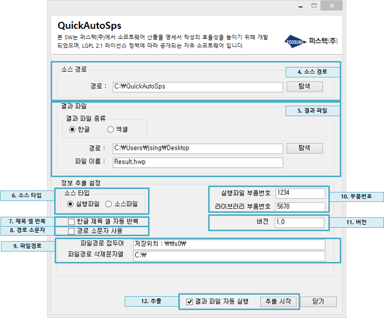

# QuickAutoSps 

QuickAutoSps는 무기체계 소프트웨어 개발 시 방위사업청에서 요구하는 소프트웨어 산출물 명세서(Software Product Specification)의 실행파일 목록 및 원본(소스)파일 목록을 빠르게 자동으로 생성해 주는 솔루션입니다. 소프트웨어 산출물 명세서 양식은 /Doc/SPS_format.hwp 파일에서 확인할 수 있습니다. QuickAutoSps는 해당 양식의 표10 실행파일 목록 및 표12 원본(소스) 목록을 양식에 맞게 자동으로 생성해 줍니다. 소개 동영상을 ['https://youtu.be/MvcIeh6vrOg'](<https://youtu.be/MvcIeh6vrOg>)에서 확인 할 수 있습니다.

[](https://youtu.be/MvcIeh6vrOg)


## 프로젝트의 목표 

우리는 QuickAutoSps 프로그램 없이 소프트웨어 산출물 명세서를 손수 작성하며 다음과 같은 문제점들을 발견하였습니다. 

- 산출물 목록 작성에 지나치게 많은 시간이 소요됩니다. (실례로 OO 프로젝트는 실행파일 및 이미지 등 약 1000개의 산출물 파일들을 포함합니다. 파일 하나에 대한 정보 확인 및 입력에 1분이 소요되고 전체를 처리하는데 약 2.08일(1000(개)/(8(시간)*60(분))이 소요됩니다)
-  산출물 목록 테이블 작성 작업은 기계적인 작업이 단순 반복됨으로 개발자의 스트레스를 증가시키고 사기를 저하시킵니다. 이는 다른 개발 업무에 부정적인 영향으로 작용합니다.
- 산출물 목록 테이블 작성 시 사용자의 실수가 잦고 실수를 찾기가 매우 어렵습니다. 따라서 사람이 손수 소프트웨어 산출물 명세서를 작성하면 자료의 신뢰성이 떨어집니다.

따라서 QuickAutoSps 프로젝트는 위 문제들을 해결하기 위해 다음과 같은 목표를 가지고 시작되었습니다. 
 
- 산출물 목록을 빠르게 자동으로 생성해 줌으로써 개발자의 시간과 에너지를 절약하여 보다 의미 있는 곳에 활용할 수 있도록 합니다.
- 개발자의 단순 반복 작업에서 오는 스트레스를 제거합니다.
- 개발자의 수작업에서 오는 실수를 제거하여 소프트웨어 산출물 명세서의 신뢰성을 향상시킵니다.
 
## 프로그램 사용 방법

 아래의 절차를 따라 산출물 목록을 자동으로 생성할 수 있습니다. 소스 타입 설정에 따라서 실행파일 목록 또는 원본(소스)파일 목록을 선택적으로 생성할 수 있습니다. GUI를 구성하는 요소 단위로 생성 절차를 설명합니다. 



1. 프로그램 설치
  - /Release 폴더에 있는 Install 파일을 통해('QuickAutoSps_setupx.x.x.exe') 프로그램을 설치할 수 있습니다. 프로그램 설치 시 종속성을 가지는 .NET Framework 4.0이 함께 설치됩니다.

2. 프로그램 실행
  - 설치 완료 후 프로그램을 실행합니다. 프로그램 실행 시 다른 한글 파일이 열려 있으면 오류가 날 수 있음으로 한글 파일을 닫으라는 알림 팝업이 도시됩니다. 

4. 소스 경로
  - 산출물 목록을 생성할 파일들이 있는 경로를 지정합니다. 탐색 버튼을 통해 경로를 탐색할 수 있습니다.

5. 결과 파일
  - 산출물 목록이 한글 파일 형식으로 생성될 것인지 액셀 파일 형식으로 생성될 것인지 선택합니다. 결과 파일이 저장될 경로와 파일명을 또한 지정합니다. 탐색 버튼을 통해 경로를 탐색할 수 있습니다. 

6. 소스 타입
  - 생성하려는 산출물 목록이 실행파일 목록인지 원본(소스)파일 목록인지 선택합니다. 

7. 제목 셀 반복
  - 결과 파일 형식이 한글 파일인 경우 테이블이 한 페이지를 넘어가는 경우 매 페이지 마다 제목 셀을 자동으로 반복할지 여부를 선택합니다. 체크 시 제목 셀이 자동 반복됩니다. 

8. 경로 소문자
  - 파일 경로를 소문자로 표시할지 선택합니다. 체크 시 파일 경로는 소문자로 표시됩니다. 

9. 파일경로
  - 만약 개발 프로그램이 임베디드 시스템에 설치 된다면 현재 파일의 경로를 타겟 시스템의 마운트된 파일 시스템 이름으로 치환할 수 있습니다. (예, 실제 윈도우에 C:\Test\QuickAutoSps.png 파일이 실제 타겟 시스템에서는 /tffs0/Test/QuickAutoSps.png 경로에 설치된다면 파일 경로 접두어를 "저장위치 : \tffs0\" 라고 입력하고, 파일경로 삭제문자열을 "C:\"로 입력하면 "C:\" 문자열이 "\tffs0\" 문자열로 치환됩니다.)

10. 부품번호
  - 실행파일 목록을 생성하는 경우 실행파일 및 라이브러리 파일의 부품번호를 기록합니다. 부품번호 입력 시 자동으로 다음과 같이 각 산출물 항목에 대해 순차적으로 번호가 부여됩니다. 
예) 실행파일 부품번호가 1234이면 차례대로 1234E001, 1234E002, 1234E003 과 같이 차례대로 번호가 부여됩니다. 

11. 버전
  - 각 산출물 파일의 버전을 기술합니다.  

12. 추출
  - 위의 정보를 입력 후 추출 시작 버튼을 선택합니다. 추출 시작 시 한글 파일 접근에 대한 허용 여부를 묻게 되는데 모두 혀용을 선택해 줍니다. 이 후 자동으로 산출물 목록을 포함하는 결과 파일이 생성됩니다. '결과 파일 자동 실행' 체크박스가 체크되어 있다면 추출 완료 후 결과 파일이 자동 실행됩니다. 

## 실행파일 구분 규칙 생성
  
  소프트웨어 산출물 명세서 표10 실행파일 목록의 구분 필드를 채우기 위한 실행파일 구분 규칙은 크게 파일 확장자에 의한 구분 규칙과 경로 내 부분 문자열 검출을 통한 구분 규칙으로 나눕니다.
1. 경로 내 부분 문자열 검출을 통한 구분 규칙
  - 파일의 전체 경로 내 특정 문자열을 검출하여 파일을 구분합니다.
  - 예를 들어 'X-WINDOW=라이브러리'라는 규칙이 있으면 C:\Package\SYSTEM\X-WINDOW 경로 이하 모든 파일은 '라이브러리' 파일로 구분됩니다.
  - 파일에 부분 문자열 검출을 통한 구분 규칙이 적용되면 확장자에 의한 구분 규칙은 적용되지 않습니다.
  - QuickAutoSps 설치 경로의 classBySubString.txt 파일에 해당 규칙을 생성할 수 있습니다. 기본적으로 아래와 같은 규칙이 적용되어 있고 '부분문자열=구분' 형식으로 추가가 가능합니다. 
```
VXWORKS=운영체제
X-WINDOW=라이브러리
```
2. 파일 확장자에 의한 구분 규칙
  - 파일의 확장자에 기반하여 파일을 구분합니다.
  - 예를 들어 '.out=실행파일' 이라는 규칙이 있으면 C:\Package\App\test.out 파일은 '실행파일' 파일로 구분됩니다.
  - QuickAutoSps 설치 경로의 classByExtension.txt 파일에 해당 규칙을 생성할 수 있습니다. 기본적으로 다음과 같은 규칙이 적용되어 있고 '.확장자=구분' 형식으로 추가가 가능합니다.
```
.out=실행파일
.exe=실행파일
.txt=환경파일
.ini=환경파일
.hosts=환경파일
.dll=라이브러리
.lib=라이브러리
.a=라이브러리
.o=라이브러리
.jpg=이미지
.png=이미지
.xpm=이미지
.sym=심볼파일
.pcf=폰트
```

## 시험 
- 추후 작성 예정.

## 개발 환경
- Visual Studio 2010 이상
- NET Framework 4.0 / Windows Form Application 
- 한글컨트롤(한글ActiveX)
- C# 

## 디렉토리 구성 
- Doc : 사용자 메뉴얼 등의 문서를 포함합니다.
- Release: 릴리즈할 설치 파일 생성 프로젝트, 릴리즈 노트 등을 포함합니다. 
- Souroce : 프로젝트 소스코드 및 프로젝트 파일을 포함합니다. 
- Test : 시험을 위한 절차서, 결과보고서, 시험 샘플 등을 포함합니다. 

## 릴리즈 버전 관리 
- 릴리즈 버전 관리를 위해  [Semantic Versioning 2.0.0](<https://semver.org/>) 문서를 참조하여 사용합니다. 

## 릴리즈 가이드 
/Release 폴더에 있는 설치 파일은 [Inno Setup Installer](<http://www.jrsoftware.org/>) 프로그램을 사용하여 만들어 졌습니다. 다음의 절차를 따라 Installer 파일을 생성할 수 있습니다. 

1.  [Inno Setup Installer](<http://www.jrsoftware.org/>) 프로그램을 설치한다.
2.  수정 및 시험 완료한 실행 파일(QuickAutoSps.exe)을 /Release/폴더에 복사한다.
3.  /Release/QuickAutoSps.iss 프로젝트 파일을 연다.
4.  Readme 파일의 '릴리즈 버전 관리' 항을 참조하여 MyAppVersion 매크로에 새로운 버전 정보를 기록한다.
5.  Inno Setup 프로그램에서 Build>Compile 메뉴를 선택한다.
6.  정상 컴파일 완료 시 /Release/Output/ 경로에 Install 파일이 생성된다. 
7.  생성된 Install 파일과 저장소 전체 압축 파일을 GitHub Release 탭에 업로드 합니다.

## 컨트리뷰션 가이드 
- 추후 작성 예정.

## 라이선스 
- QuickAutoSps 프로젝트는 GNU Lesser General Public License 2.1 라이선스를 적용합니다. 자세한 내용은 LICENSE 파일을 참조하십시요.

## 개발자 
사용 및 컨트리뷰션 문의 사항은 아래로 연락바랍니다. 
- 한주승 : joosing711@gmail.com
- 강민우 : mwii@me.com
